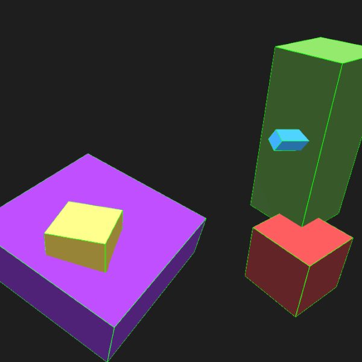
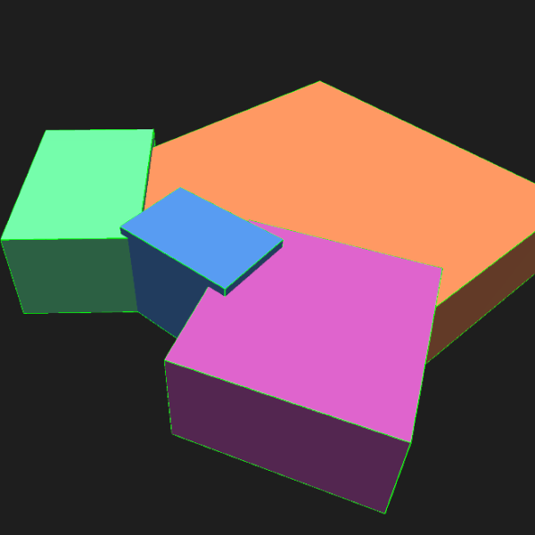

# Face Remove

Given the sizes, positions and orientations of cubes in 3D space, finds cube faces which are hidden from view and removes them. Disabling rendering for hidden faces nets a significant performance boost with no change in appearance.

A significant improvement over the Krunker Editor face optimizer, which can only handle one-on-one face overlaps.


## Setup on Linux/BSD

`python3` and `gcc` must be installed

```bash
# clone repo
git clone https://github.com/Infinitifall/face-remove
cd face-remove

# build
make
```

Paste your map export in `input.json`

```bash
# run
python3 run.py
```


## How it works

To determine if a face is hidden we check if all points on an $n \times n$ grid are touching or covered by another cube. We can get an arbitrarily accurate (albeit computationally heavy) solution as $n \rightarrow \infty$. For most scenarios though, $n \approx 20$, checking 400 points per face, works just fine, which is what we do here.

## Example scenarios




